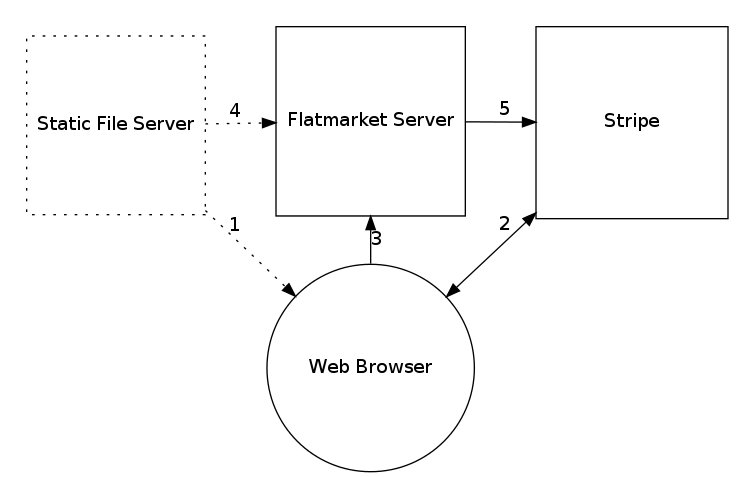

# flatmarket

[](https://circleci.com/gh/christophercliff/flatmarket) [](http://codecov.io/github/christophercliff/flatmarket?branch=master)

Flatmarket is a free, open source e-commerce platform for static websites. It is reliable, secure, and inexpensive to operate.

The platform uses [Stripe](https://stripe.com/) for payment processing and is built on the latest web technologies like [hapi](http://hapijs.com/), [React](http://facebook.github.io/react/), and [Webpack](http://webpack.github.io/).

At its core is a batteries-included CLI to help you get started quickly. Modules are also packaged individually so you can customize your rig.

## How it works

The Flatmarket architecture consists of a static website paired with a [proxy server](https://github.com/christophercliff/flatmarket-server) for sending payments to Stripe. The browser and server share a public schema ([represented by a JSON document](https://github.com/christophercliff/flatmarket-schema)) to prevent charge tampering. The store operator can manage inventory and store configuration by updating the schema document.

### Architecture



1. The web browser loads the single-page app from the static file server (e.g. AWS S3).
2. The user submits their credit card information with Stripe Checkout and the web browser obtains a new Stripe token.
3. The web browser sends the token and product ID the Flatmarket server.
4. The Flatmarket server pulls the product information from `flatmarket.json` hosted on the static file server.
5. The Flatmarket server sends the charge to Stripe.

## Live Demo

Take a minute to go try [the live demo](https://christophercliff.com/flatmarket/).

## Design goals

- [x] It should cost next-to-nothing to operate.
- [x] It should should be reliable and scalable. This is achieved by offloading expensive and complicated operations to third-party services.
- [x] It should be secure.
- [x] It should be easy to customize, update, and deploy.

## Features

- Customizable React UI (or use whatever frontend you prefer)
- Separate billing and shipping addresses
- Subscription billing
- Supports many [global currencies](https://support.stripe.com/questions/which-currencies-does-stripe-support)
- Manual [charge authorization](https://support.stripe.com/questions/does-stripe-support-authorize-and-capture)
- Bitcoin
- Mobile-ready
- [and more...](https://github.com/christophercliff/flatmarket-schema/blob/master/SPECIFICATION.md)

## Use cases

Flatmarket isn't appropriate for every e-commerce project, but it is uniquely suited for the following situations:

- high traffic but low sales volume.
- high touch, where every transaction requires human involvement.
- sale of digital goods, made-to-order goods, or donations (where stock keeping is not required).
- any situation where low cost is a priority.

## Installation

```sh
$ npm install flatmarket
```

## Quick Start

### 1.

[Deploy](https://heroku.com/deploy?template=https://github.com/christophercliff/flatmarket-server-heroku) a Flatmarket server to your Heroku account.

### 2.

Create a [schema](https://github.com/christophercliff/flatmarket-schema) document at `./src/flatmarket.json`

```json
{
  "info": {
    "name": "Your Store"
  },
  "products": {
    "sku_001": {
      "amount": 1000
    }
  },
  "server": {
    "host": "your-flatmarket-server.herokuapp.com"
  },
  "stripe": {
    "publishableKey": "your_publishable_key"
  }
}
```

### 3.

Build the Flatmarket website and deploy to your favorite static web host.

```sh
$ flatmarket ./src/flatmarket.json
```

### 4.

Read the [API reference](https://github.com/christophercliff/flatmarket/blob/master/REFERENCE.md) and [customization guide](https://github.com/christophercliff/flatmarket/blob/master/CUSTOMIZATION.md) to learn more.

## Platform

- [flatmarket-client](https://github.com/christophercliff/flatmarket-client) A browser client for Flatmarket.
- [flatmarket-example](https://github.com/christophercliff/flatmarket-example) A complete example of a Flatmarket.
- [flatmarket-schema](https://github.com/christophercliff/flatmarket-schema) A JSON schema utility for Flatmarket.
- [flatmarket-server](https://github.com/christophercliff/flatmarket-server) A standalone web server for Flatmarket.
- [flatmarket-server-heroku](https://github.com/christophercliff/flatmarket-server-heroku) A Flatmarket server for [Heroku](https://www.heroku.com/).
- [hapi-flatmarket](https://github.com/christophercliff/hapi-flatmarket) A hapi plugin for Flatmarket.
- [hapi-stripe-webhooks](https://github.com/christophercliff/hapi-stripe-webhooks) Listen for notifications from Stripe.

## Themes

- [Bananas](https://github.com/christophercliff/flatmarket-theme-bananas)

## Reference

See [REFERENCE](https://github.com/christophercliff/flatmarket/blob/master/REFERENCE.md).

## Customization

See [CUSTOMIZATION](https://github.com/christophercliff/flatmarket/blob/master/CUSTOMIZATION.md).

## Contributing

See [CONTRIBUTING](https://github.com/christophercliff/flatmarket/blob/master/CONTRIBUTING.md).

## License

See [LICENSE](https://github.com/christophercliff/flatmarket/blob/master/LICENSE.md).
